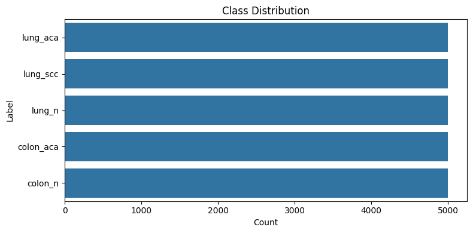
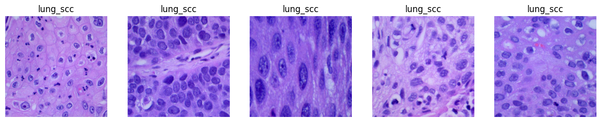
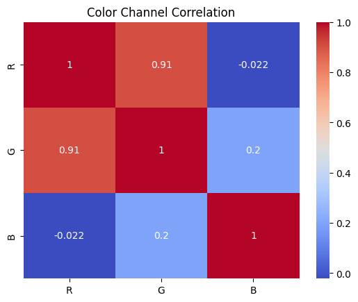
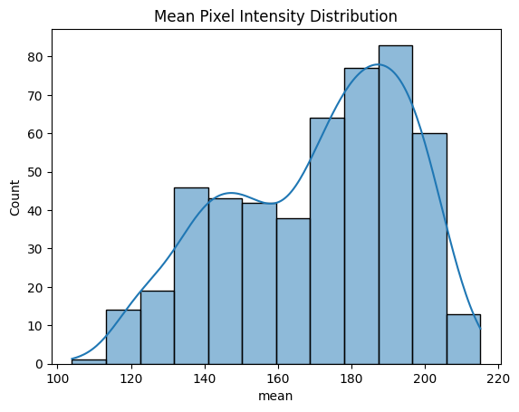

# 🧬 ColoractalCancer - Histopathological Lung and Colon Cancer Classification

A deep learning project using transfer learning (ResNet-18) to classify histopathological images of lung and colon tissue. Includes extensive exploratory data analysis (EDA), training comparison using various optimizers, and performance tracking.

---

## 🔗 Dataset Source

**📌 Kaggle**: [Lung and Colon Cancer Histopathological Images](https://www.kaggle.com/datasets/andrewmvd/lung-and-colon-cancer-histopathological-images)

---

## 🗂️ Dataset Structure

```plaintext
lung_colon_image_set/
├── colon_image_sets/
│   ├── colon_aca/
│   └── colon_n/
└── lung_image_sets/
    ├── lung_aca/
    ├── lung_scc/
    └── lung_n/
```

### 🧬 Binary Label Mapping for Tissue Classes

The dataset's original tissue classes are mapped to binary labels for cancer detection:

- **Label 0 (Non-cancerous / Normal tissue):**
  - `ADI`: Adipose tissue
  - `BACK`: Background (non-tissue)
  - `DEB`: Debris
  - `LYM`: Lymphocytes
  - `MUC`: Mucus
  - `MUS`: Muscle
  - `NORM`: Normal colon mucosa

- **Label 1 (Cancerous / Tumor-related tissue):**
  - `STR`: Stroma (connective tissue, often altered in cancer)
  - `TUM`: Tumor epithelium


## 📊 Exploratory Data Analysis

### ✔️ Class Distribution
- Visualized using seaborn bar plots.
- Displays the number of samples per class.
- 

### 🖼️ Sample Images per Class
- Displays 5 randomly sampled images for each label.
- 

### 🔗 Color Channel Correlation
- Pearson correlation matrix between R, G, and B channels.
- 

### 📈 Mean Pixel Intensity Distribution
- Histogram of grayscale mean intensity values from 500 random samples.
- 

## 🧪 Dataset Statistics
- **Mean RGB (1000 samples):** Computed for dataset normalization.
- **Standard Deviation RGB:** Used for `transforms.Normalize()`.
- **Corrupt Images:** Automatically detected and skipped using `PIL.Image.verify()`.

---

## 🚀 Model Training & Results

### 🔧 Model Configuration
- Base model: ResNet-18 pretrained on ImageNet.
- Frozen layers: All except final FC layer.
- Output classes: 5 (replacing original FC layer).
- Image input size: 224x224
- Normalization: mean = `[0.5, 0.5, 0.5]`, std = `[0.5, 0.5, 0.5]`

### ⚙️ Optimizers Used

| Optimizer | Learning Rate | Best Val Accuracy | Training Time |
|-----------|---------------|------------------|---------------|
| Adam      | 0.0001        | 99.26%           | 12m 15s       |
| Adam      | 0.001         | 99.90%           | 12m 31s       |
| SGD       | 0.01          | 99.92%           | 12m 19s       |

---
### 📊 Evaluation on New Data

| Model            | Accuracy | Cohen’s Kappa | AUC    |
|------------------|----------|----------------|--------|
| **CNN–ViT Hybrid** | **0.9937** | **0.9825**     | 0.9998 |
| **ResNet50**       | 0.9909   | 0.9748          | **0.9999** |

> These results highlight the strong generalization capability of both models on unseen data, with CNN–ViT Hybrid achieving the highest accuracy and Kappa score, while ResNet50 scored the best AUC.

---

## 🙌 Acknowledgments

- **Dataset:** The histopathological image dataset utilized in this project is the [Lung and Colon Cancer Histopathological Images (LC25000)](https://www.kaggle.com/datasets/andrewmvd/lung-and-colon-cancer-histopathological-images) from Kaggle. This dataset comprises 25,000 color images across five classes: colon adenocarcinoma, benign colonic tissue, lung adenocarcinoma, lung squamous cell carcinoma, and benign lung tissue. All images are de-identified, HIPAA compliant, validated, and freely available for download to AI researchers. [arxiv.org](https://arxiv.org/abs/1912.12142)

- **Pretrained Models:** Model architectures and pretrained weights were sourced from [torchvision](https://pytorch.org/vision/stable/models.html), a library that provides access to over 60 pretrained models, including ResNet-18, VGG16, and DenseNet, trained on the ImageNet dataset. These models are widely used for transfer learning in computer vision tasks. [pytorch.org](https://pytorch.org/vision/stable/models?utm_source=chatgpt.com)
